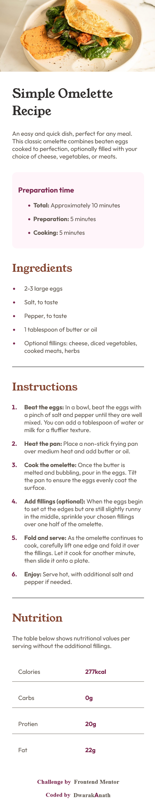

# Frontend Mentor - Recipe page solution

This is a solution to the [Recipe page challenge on Frontend Mentor](https://www.frontendmentor.io/challenges/recipe-page-KiTsR8QQKm). Frontend Mentor challenges help you improve your coding skills by building realistic projects.

## Table of contents

- [Overview](#overview)
  - [The challenge](#the-challenge)
  - [Screenshot](#screenshot)
  - [Links](#links)
- [My process](#my-process)
  - [Built with](#built-with)
  - [What I learned](#what-i-learned)
  - [Useful resources](#useful-resources)
- [Author](#author)

## Overview

### Screenshot



### Links

- Solution URL: [https://github.com/DwarakanathAkkala/FEM-Recipe-Page]
- Live Site URL: [https://fem-recipe-page-dwaraka.netlify.app/]

## My process

### Built with

- Semantic HTML5 markup
- CSS custom properties
- Flexbox
- CSS Grid
- Mobile-first workflow

### What I learned

```html
<ul>
  <li>
    <span><b>Total:</b> Approximately 10 minutes</span>
  </li>
  <li>
    <span><b>Preparation:</b> 5 minutes</span>
  </li>
  <li>
    <span><b>Cooking:</b> 5 minutes</span>
  </li>
</ul>
```

```css
/* - Awesome design of only one border without any gap between two columns is possible by the below "border-collapse" property. */

table {
  width: 100%;
  border-collapse: separate;
  border-spacing: 0 1rem;
}

/* - Customised Color text for the second Column.  */

td:nth-child(even) {
  color: hsl(332, 51%, 32%);
  font-weight: bold;
}
```

### Useful resources

- [Stack Overflow](https://stackoverflow.com/) - This helped me in using the "border-collapse" property by the community solutions.

## Author

- Website - [Dwarakanath](https://dwarakanath-akkala.netlify.app/)
- Frontend Mentor - [@DwarakanathAkkala](https://www.frontendmentor.io/profile/DwarakanathAkkala)
- Instagram - [@dwarakanath_akkala](https://www.instagram.com/dwarakanath_akkala/)
